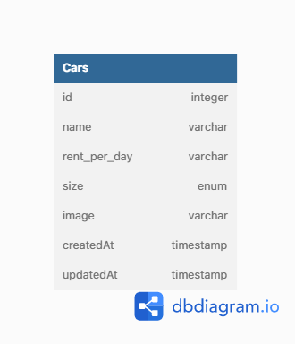

# Binar Challenge Chapter 4 - Car Management Dasboard

Repository ini dibuat untuk memenuhi challenge chapter 4 dari Studi Independen Binar Academy.

## Database Diagram

## Endpoint

1. Menampilkan halaman utama | GET: <http://127.0.0.1:4000/>
2. Menampilkan halaman tambah data | GET: <http://127.0.0.1:4000/cars/create>
2. Menambahkan data | POST: <http://127.0.0.1:4000/cars/create>
3. Menampilkan halaman perbarui data | GET: <http://127.0.0.1:4000/cars/edit/:id>
3. Memperbarui data | POST: <http://127.0.0.1:4000/cars/update/:id>
4. Menghapus data | GET: <http://127.0.0.1:4000/cars/delete/:id>